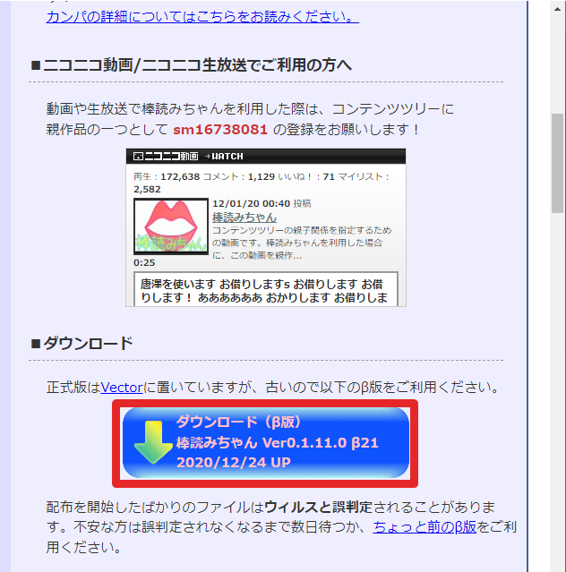
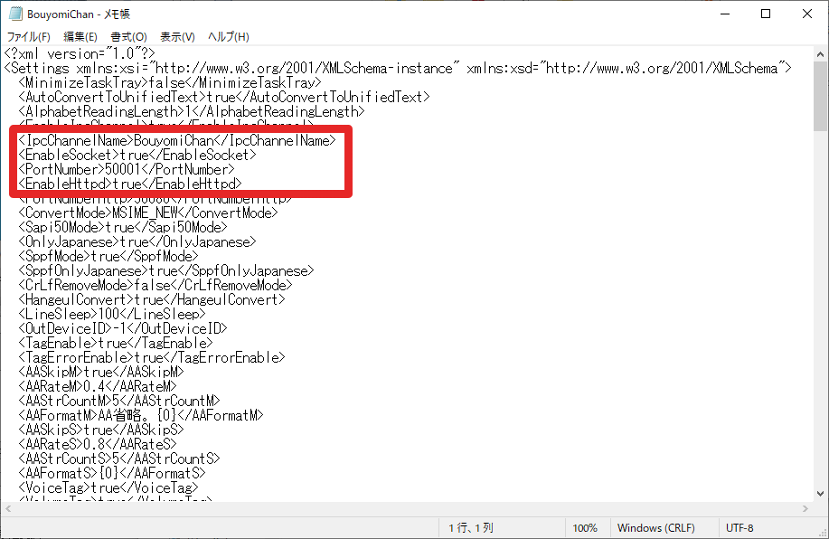

# 棒読みちゃんの設定

## 棒読みちゃんの解凍

**最新版**をダウンロードしてきます。

必要な人数分、フォルダを展開します。
展開する場所はどこでも大丈夫です。
あとで必要なので、フォルダ名が被らないようにしてください。

例) C:\Users\name\Downloads\BouyomiChan_0_1_11_0_Beta21_A

## 棒読みちゃんの設定

展開したら、以下の作業をそれぞれの棒読みちゃんで行います。

1. 一度起動して、全ての確認メッセージに答えた後、棒読みちゃんをを終了する
    - "このプラグインを有効にしますか？"みたいなの
        - 今回は全部"いいえ"でOK
    - BouyomiChan.settingが生成される
1. BouyomiChan.settingをメモ帳で開く
    - 棒読みちゃんの名前を決め、\<IpcChannelName\>BouyomiChan\</IpcChannelName\>に記入する
        - 例) BouyomiChan*A*
        - 必ずBouyomiChan**以外**に変更する
    - 以下の*true*を*false*に変更する
        - \<EnableSocket\>*true*\</EnableSocket\>
        - \<EnableHttpd\>*true*\</EnableHttpd\>
1. 保存する

棒読みちゃんの声の設定はそれぞれで管理されています。
BouyomiChanAは普通の声、BouyomiChanBは高い声のように設定しておくと聞き分けやすいでしょう。
一度設定しておくと、次に起動したときにも同じ設定で喋ってくれます。