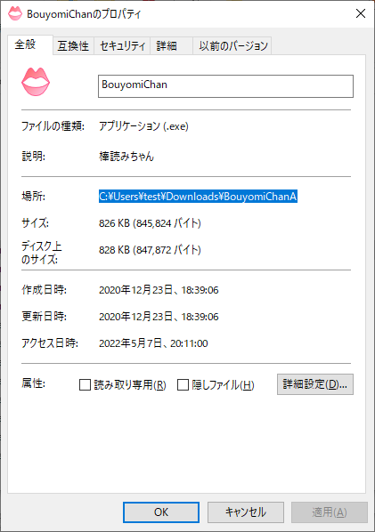
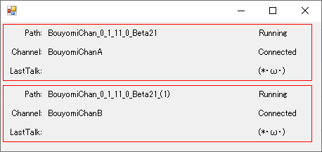

# MultiBouyomiSelector側

## 設定
[MultiBouyomiSelector](https://github.com/kure3rd/MultiBouyomiSelector/releases/latest)を解凍してsettings.xmlを開きます。
以下のような部分があります。

```xml
...
    <BouyomiChanLocations>
        <BouyomiChanA>C:\Users\test\Downloads\BouyomiChan_0_1_11_0_Beta21</BouyomiChanA>
        <BouyomiChanB>C:\Users\test\Downloads\BouyomiChan_0_1_11_0_Beta21_(1)</BouyomiChanB>
    </BouyomiChanLocations>
...
```
\<BouyomiChanLocations\>と\</BouyomiChanLocations\>の間に、先程設定したそれぞれの棒読みちゃんのチャンネル名と場所を書いていきます。

書き方は
```xml
<棒読みちゃんのチャンネル名>棒読みちゃんのフォルダ</棒読みちゃんのチャンネル名>
```
です。

- 棒読みちゃんの名前は、棒読みちゃんの基本設定で書いたチャンネル名です。
- 棒読みちゃんのフォルダは、棒読みちゃんを展開したフォルダ名です。
    - BouyomiChan.exeを右クリック->プロパティからコピーできます。



（
もともと書いてある2行はただの設定例です。
必要ないので消してください。
）

## 動作確認

1. MultiBouyomiSelector.exeを起動します。
    - 設定されているBouyomiChan.exeが一斉に起動します。
    - エラーが出るときはHelpページを参照してください。
1. 下図のような状態になれば、設定がうまくいっています。

