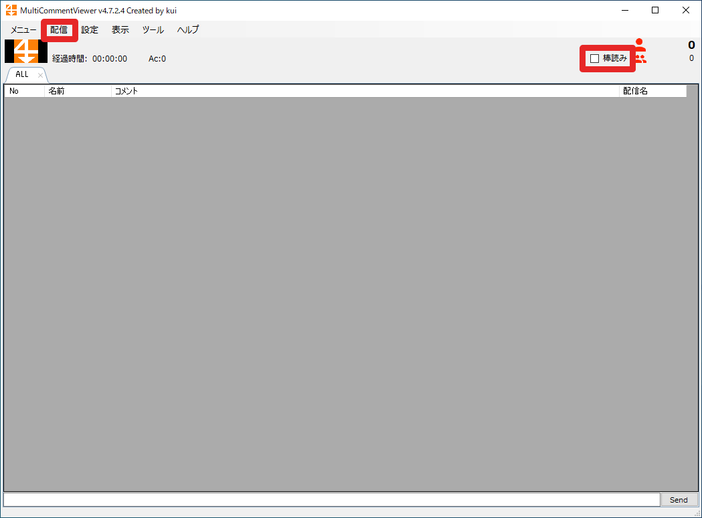
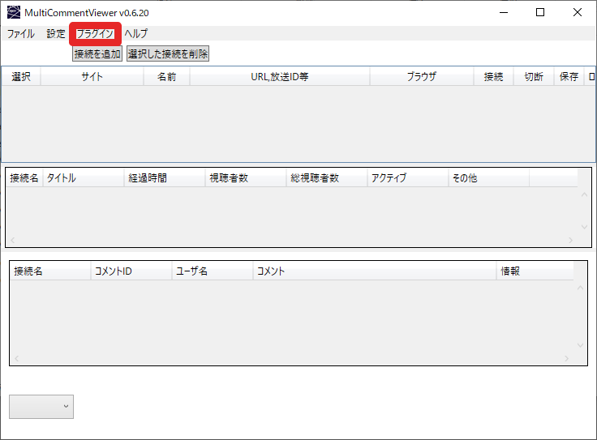

# MultiCommentViewerのインストール

同一の名前で2種類あります。
どちらも棒読みちゃんに対応しており、MultiBouyomiSelectorでもそのまま使えます。
対応ストリームやデザイン、オープンソースかどうかなど、お好みで選んでください。
（MultiCommentViewerでなくとも、棒読みちゃんとIPC通信するプログラムなら動くはずです。多分。）

どちらのMultiCommentViewerについても解説します。

1. kui氏作MultiCommentViewer
    - [MultiCommentViewerのDownload \| kuiのブログ](https://develop-kui.com/blog/multicommentviewer-download/)
1. ryu-s氏作MultiCommentViewer
    - [コメビュとかツールとか \-](https://ryu-s.github.io/app/multicommentviewer)

## kui氏作MultiCommentViewer

1. 右上の"棒読み"にチェックを入れる
1. 配信->追加から読み上げさせたい配信を追加
    - コメントが流れ始めます
1. 棒読みちゃんたちが喋り始めます

## ryu-s氏作MultiCommentViewer

1. プラグイン->棒読みちゃん連携
    - 設定窓が開きます
1. "棒読みちゃんにコメントを読んでもらう"にチェック
    - その他、基本設定タブや読んでもらうメッセージタブもお好みで設定
        - MultiBouyomiSelector.exeは棒読みちゃんではないので場所は指定できないようです
        - 棒読みちゃんの自動実行は設定しないほうが良いかも…未検証
1. "接続を追加"ボタンを押し、読み上げさせたい配信を追加
    - コメントが流れ始めます
1. 棒読みちゃんたちが喋り始めます